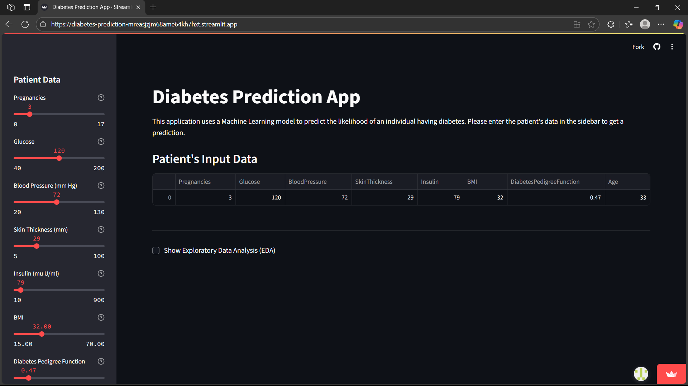
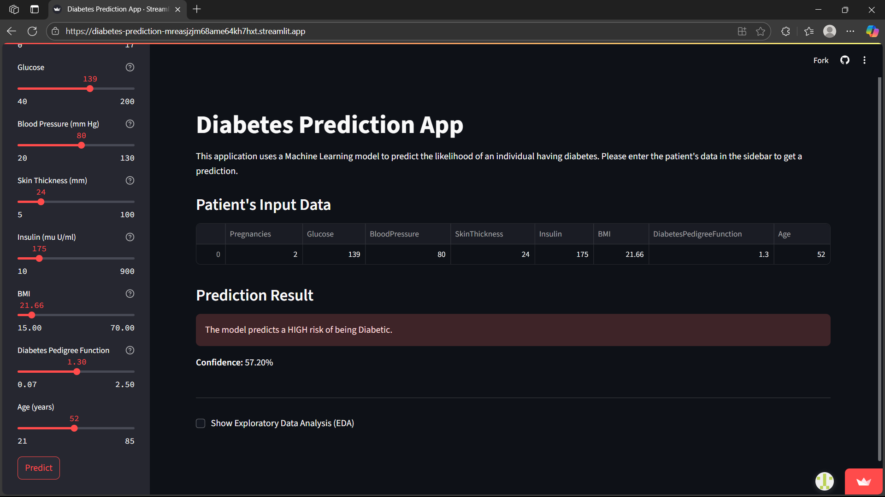
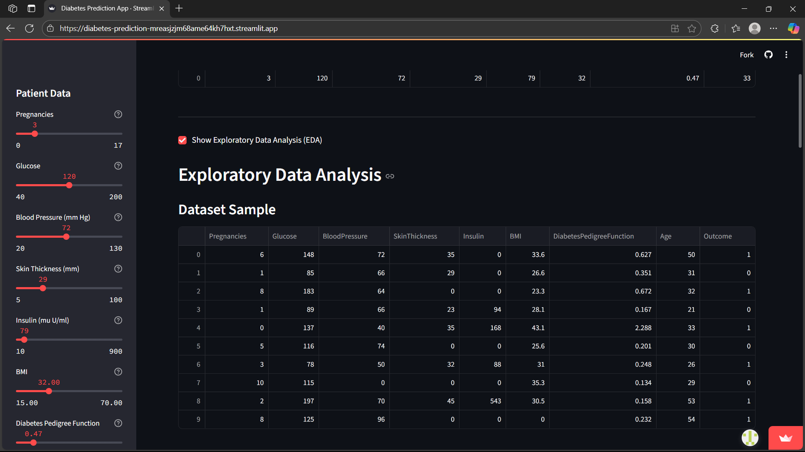
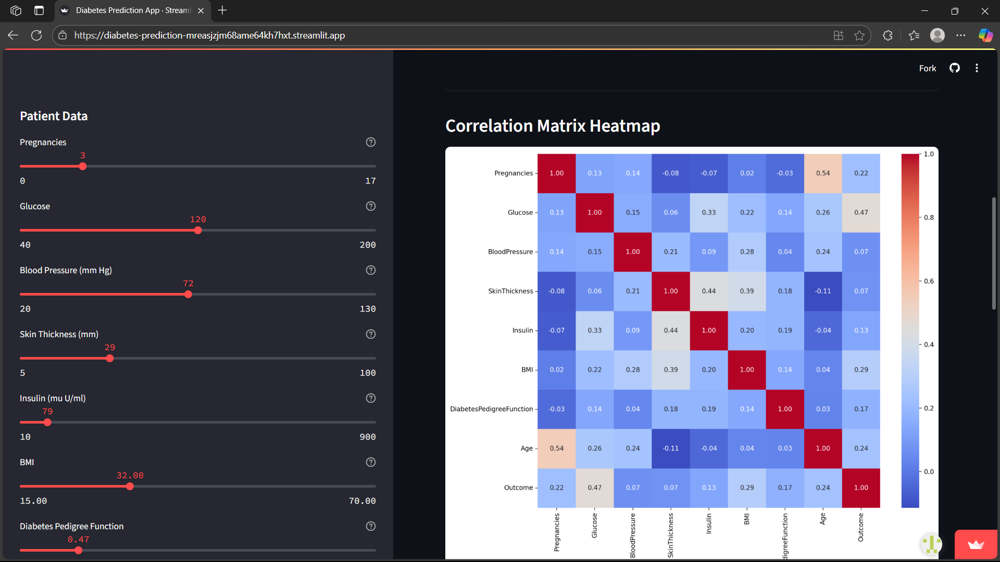
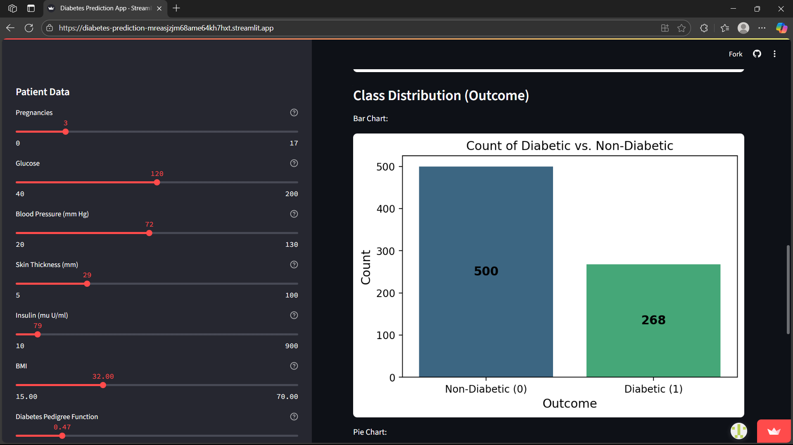
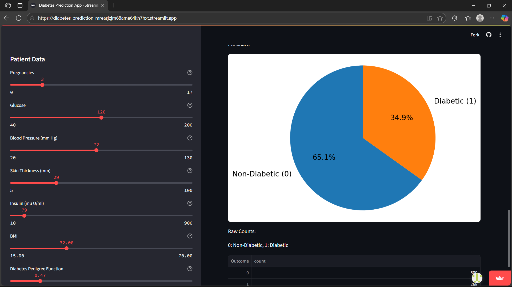

# Logistic Regression-based Predictive Analysis of Diabetes

## Overview
This project involves predicting the probability of patients having diabetes using **Logistic Regression**, a supervised machine learning model. The model is trained on a dataset with definite health-related features like glucose, blood pressure, BMI, and insulin. The objective is to predict if a patient is diabetic (`1`) or non-diabetic (`0`) based on these features.

## Characteristics
### Dataset
The data set consists of medical records with the following characteristics:
- **Pregnancies**
- **Glucose**
- **BloodPressure**
- **SkinThickness**
- **Insulin**
- **BMI**
- **DiabetesPedigreeFunction**
- **Age**
- **Outcome** (Target Variable)

## Live Demo

[Live App on Streamlit Community Cloud](https://diabetes-prediction-mreasjzjm68ame64kh7hxt.streamlit.app/)

## Screenshots

**Home Page**

* **Patient's Input Data**

* **Predicted Output**

**Exploratory Data Analysis (EDA)**

* **Dataset Sample**

* **Correlation Matrix Heatmap**

**Class Distribution (Outcome)**

* **Bar Chart**

* **Pie Chart & Raw Counts**

### Logistic Regression Model
- **Binary classification** (Diabetic/Non-Diabetic).
- **Assessment metrics**: Accuracy, Precision, Recall, and F1-Score. - **Preprocessing**: Feature scaling and train-test splitting for better performance.

## Findings - Reached a **~74.48%** accuracy (potentially varies depending on data splits). - **Most influential factors**: Glucose levels, BMI, and Age have high predictive value for diabetes.